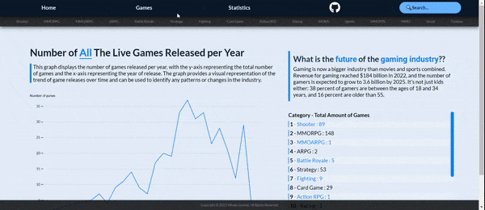
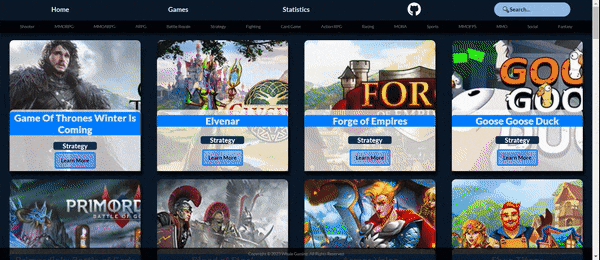
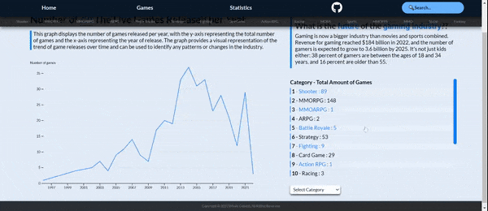

# 🐳Whale Gaming Javascript Project

Javascript Project based on live game API 🎮

# Live Link

> https://usenavigate.github.io/Whale_Gaming_Javascript_Project/

## Background

> Welcome to `Whale Gaming`, a gaming website that offers information and data visualization based on the MMOBomb API. This website aims to provide a user-friendly and informative platform for gamers and enthusiasts to explore and discover games based on different categories and genres.🐋.

## Functionality & MVPs

In `Whale Gaming` , users will be able to:

> - View data visualization
>   - Whale Gaming provides a visually appealing and interactive way of exploring the number of games released per year based on categories

> - Use the search functionality
>   - Users can search for their favorite games using our search bar

> - View game details
>   - Users can click on a game card to view its details such as description, gameplay, and more. This helps users to get a better understanding of the game before deciding to play or purchase it

## Wireframes

### Main Page

> 

### Navigation

> 

### Cards and Details

> 

### Search and Details

> 

### Data Visualzation

> 

### api.js

> - In order to improve the user experience and avoid server errors, I created a separate function called 'useData()' that retrieves the necessary data for game searches. This allows users to search for games without triggering unnecessary fetch calls and reduces the likelihood of encountering errors.

```javascript
export async function useData() {
  if (!allData || !gamesByReleaseDate || !gamesByGenre) {
    await getAllData(games, options);
  }

  const data = {
    allData,
    gamesByReleaseDate,
    gamesByGenre,
  };
  return data;
}
```

### Line Graph

> - I excluded games without a specific release date, marked as '0000-00-00', from my dataset. To better visualize the distribution of game releases over time, I created a custom function that counts the number of games released in each year and used it to generate the y-axis.

```javascript
export function createChart(data,genre) {
  // Extract the release year from each game and create an array of objects
  const games = data
    .filter((d) => d.release_date !== "0000") // exclude games with release year of "0000"
    .map((d) => {
      const year = Date.parse(d.release_date)
        ? new Date(d.release_date).getFullYear()
        : null;
      return { release_year: year };
    });

  // Count the number of games released in each year
  const totals = games.reduce((acc, game) => {
    if (game.release_year !== null) {
      if (!acc[game.release_year]) {
        acc[game.release_year] = 0;
      }
      acc[game.release_year]++;
    }
    return acc;
  }, {});

  ...}
```

## Technologies, Libraries, APIs

> - `mmobomb-api` (https://www.mmobomb.com/api)
> - `d3.js` (https://d3js.org/)

## Implementation Timeline

### Friday

> - fetch all the API data
>   - store as a variable to reduce amount of unnecessary fetch calls
> - render basic html
>   - navbar / main page

### Saturday

> - Construct Data
>   - restructure the fetched data into a suitable format for data visualization, which enable accurate representation of trends and patterns in the gaming industry
> - Learn about d3 line graph
> - Parse data to csv

### Sunday

> - Render basic d3 line graph
> - Add tool tip for the graph

### Monday

> - DOM
>   - Added featured functionality eventlistners for
>     - Click ( navbar / main page / cards / filter)
>   - Input (search)
>     - improved the search functionality by implementing a delay in fetching results. the API won't be called immediately when the user types in the search bar, but rather after a brief pause in typing to reduce unnecessary API calls.

### Tuesday

> - Added favicon
> - CSS for Styling
> - linkes all the component by reconstructing DOM
> - Fixed minor bugs

### Wednesday

> - Testing
>   - finalize the website
> - Added github link

### Thursday

> - Added User's Guide
> - Update README.md
